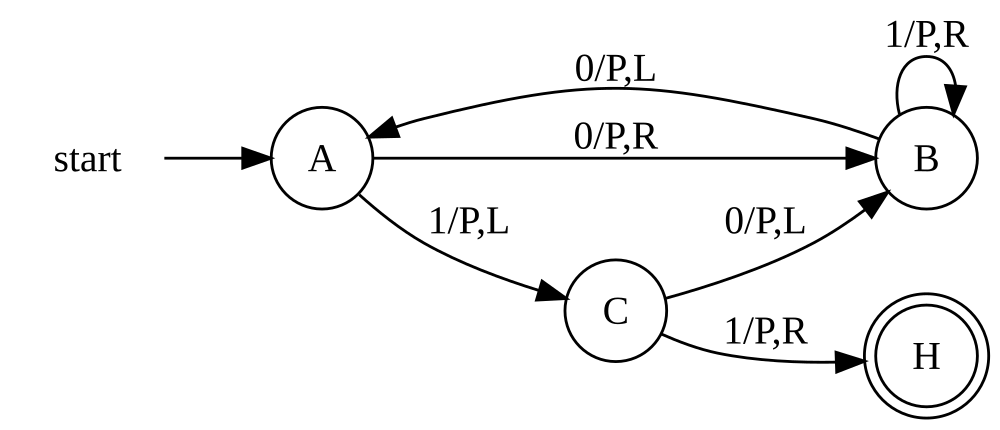
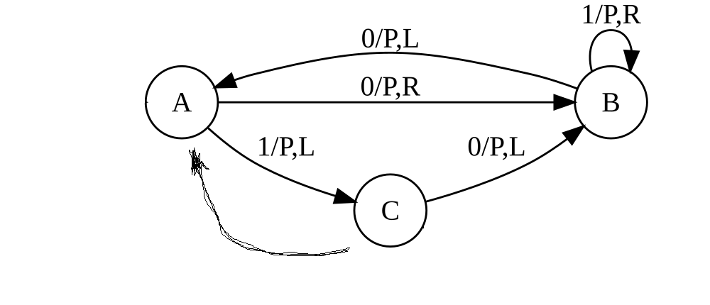

# Description 
The halt problem asserts that we cannot prove that the program stops or run forever. That's why we do it simultaneously. But as a result, the points will be in superposition in meaning that's any of each can be halt point or start loop point.

We need three conditions to be satisfied simultaneously:
1. Find a point that we will go through exactly twice. 
2. New transition that has not yet happened (point two unique)
3. Transition point where we have been exactly twice to a point where we have been only once.

# Example Busy beaver(3)

Default formulation of the problem 

To resolve it superposition, i assume that program run infinity from point "A". 

Updated formulation of the problem

So i say tha's start point of the loop is "A". 
End the halt point is "C".

# Unraveling Superpositions
In real code, instruction have semantic also, if we found the minimum. My hypothesis is that there is a method to come up with to see them all in order by time. Provided that we know at least one most upperest halt point or run loop point (for usual programm it is just main function's that's we expect halt), then we resolve all points in the superpositions.

# Hypothesises
1. So where "halt point"? Halt point every where (depends of watcher), and start of loop after placed after it.
2. I find the halt point and the start point of the loop at the same time, in fact I find two equivalent programs at once, one that halt and the other run infinity.
3. After resolving all superpositions, code that is not reachable (traversed zero times) is completely unreachable

# Special thanks my friends
Vyacheslav Goma, Hirrolot, Dmitry Ylin
